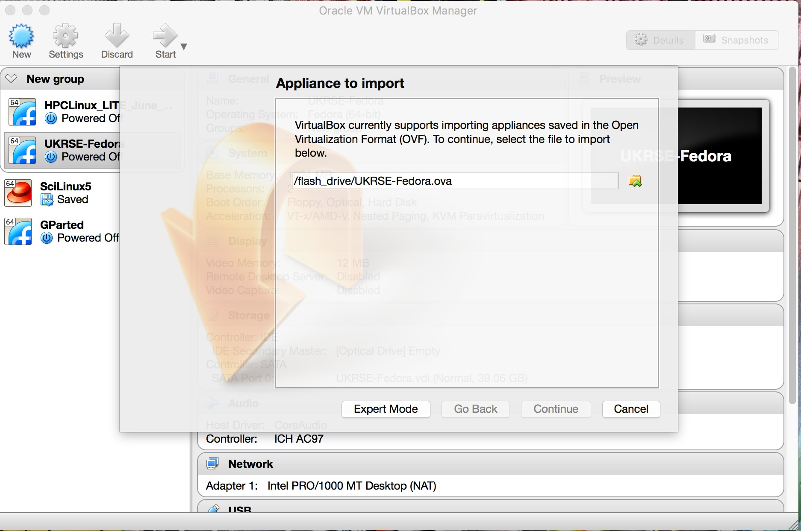
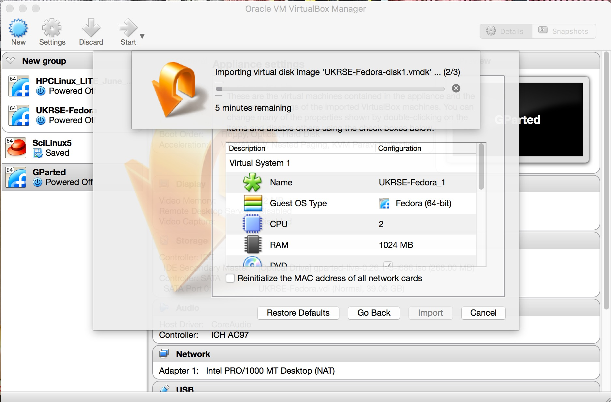
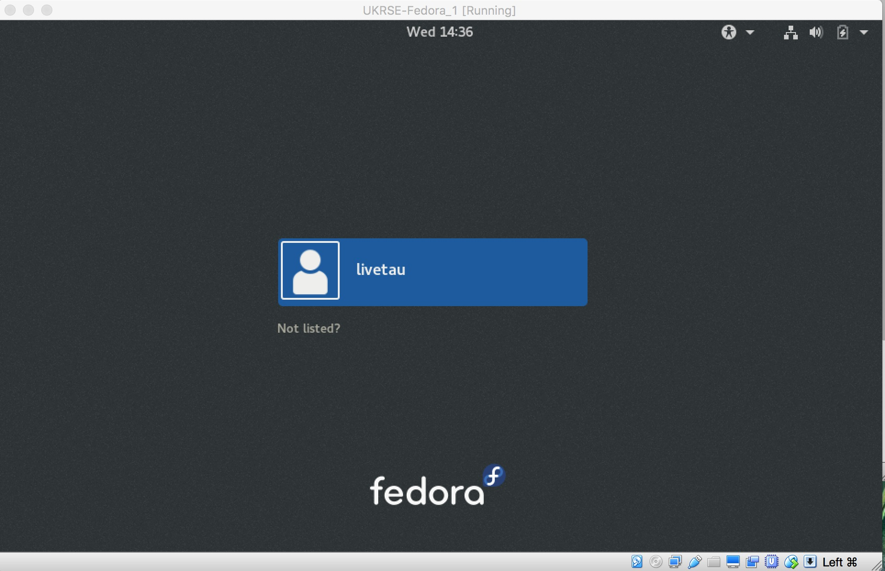
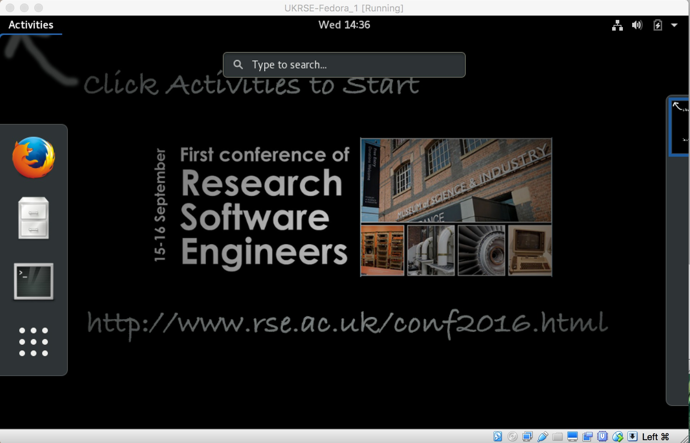

<ul>
  <li><a href="conf2016">Home</a></li>
  <li><a href="conf2016_programme">Programme</a></li>
  <li><a href="conf2016_venue">Venue</a></li>
  <li><a href="conf2016_accommodation">Hotels</a></li>
  <li><a href="conf2016_diversity">Diversity</a></li>
  <li><a href="conf2016_registration">Registration</a></li>
  <li><a href="conf2016_promotion">Promotion</a></li>
  <li><a href="conf2016_sponsors">Sponsorship</a></li>
  <li><a href="conf2016_contact">Contacts</a></li>
</ul>

Thank you for coming to attend the 2016 RSE Conference.

## Bring a Laptop

If you are attending one of the practical workshops (A1-A4, B1-B4 or C1-C4, attendance list [here](https://drive.google.com/open?id=0B_KkGMZ8ACfaYjNhM3lMbmhUVUk)), then you will need to bring your own laptop. This laptop must;

* run Windows, Linux or OS X,
* have at least 2 GB of RAM,
* have a spare USB port,
* and have at least 25 GB of free disk space

**Before you arrive in Manchester** you must install [VirtualBox](https://www.virtualbox.org) onto your laptop. You can [download VirtualBox from here](https://www.virtualbox.org/wiki/Downloads), with installation instructions available [on this page](https://www.virtualbox.org/wiki/Downloads).

The workshops will run inside a custom Fedora Linux Virtual Machine Image within VirtualBox. This will be supplied to you at Manchester on a USB drive. Please make sure that you install this image before starting the first workshop (instructions below on how to do this). Feel free to ask any member of the conference committee, or the conference volunteers over lunch on Thursday, if you need any help.

If you want to install the Virtual Machine Image before coming to Manchester, you can download it [from here](https://drive.google.com/open?id=0B-yOUgABf0mBaVBLMTRUb1Zncjg). Beware, as it is pretty big (13 GB) and may take a long time to download. If you are interested, the full contents of the USB drive are available [here](https://drive.google.com/open?id=0B_KkGMZ8ACfadjNKYU9GSzFpTm8).

## Installing the VirtualBox Virtual Machine Image

On the USB drive you will find a file called `UKRSE-Fedora.ova`. To install the image, start VirtualBox, and then select `File | Import Appliance`. Use the file dialog to choose the `UKRSE-Fedora.ova` file from the USB drive.

Click "Continue" to select this file. Next, click `Import` to import the image. This will take some time, and will take up XXX GB on your disk.

Once the image has imported, you can start the virtual machine by clicking on the `UKRSE-Fedora` button that will appear on the left of the display. This will boot into a Fedora Linux desktop.

To log in, click on the username `livetau` and type in the password `livetau` (both the username and password are `livetau`).

This will log you into the Fedora desktop. Click on the `Activities` button on the top left to find the icons to start a web browser (Firefox), a terminal or a web browser. All of the workshop material is in the directory `/home/livetau/workshops`.

 
 
 
