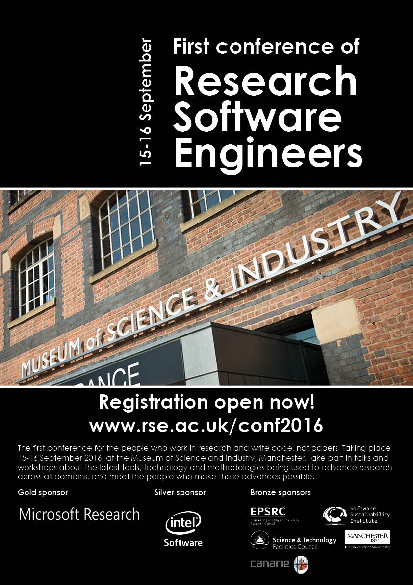

<ul>
  <li><a href="conf2016">Home</a></li>
  <li><a href="conf2016_programme">Programme</a></li>
  <li><a href="conf2016_venue">Venue</a></li>
  <li><a href="conf2016_accommodation">Hotels</a></li>
  <li><a href="conf2016_diversity">Diversity</a></li>
  <li><a href="conf2016_registration">Registration</a></li>
  <li><a href="conf2016_promotion">Promotion</a></li>
  <li><a href="conf2016_sponsors">Sponsorship</a></li>
  <li><a href="conf2016_contact">Contacts</a></li>
</ul>

# Promotional Materials for the Conference

The success of this meeting depends greatly on you. Please help us to promote the meeting using the materials below;

## Posters

Please help spread the word about the current [call for talks](conf2016_calls_talks) and [call for workshops](conf2016_calls_workshops) by sharing [this poster](RSEConf16_Poster_Flyer_July16.pdf).

## Twitter

Please use the hashtag #RSE16 to help spread the word about this conference. Please feel free to tweet questions, announce your attendance, to comment during the conference etc.

 
 
 
