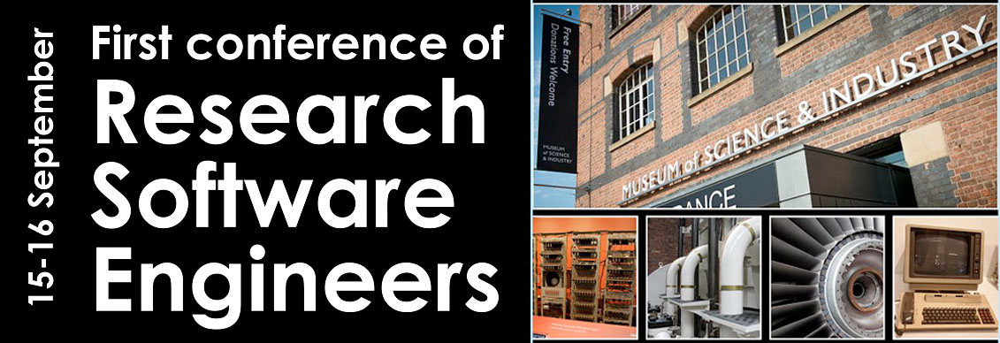

<ul>
  <li><a href="conf2016">Home</a></li>
  <li><a href="conf2016_programme">Programme</a></li>
  <li><a href="conf2016_venue">Venue</a></li>
  <li><a href="conf2016_accommodation">Hotels</a></li>
  <li><a href="conf2016_diversity">Diversity</a></li>
  <li><a href="conf2016_registration">Registration</a></li>
  <li><a href="conf2016_promotion">Promotion</a></li>
  <li><a href="conf2016_sponsors">Sponsorship</a></li>
  <li><a href="conf2016_contact">Contacts</a></li>
</ul>

## Workshop abstracts

### Workshop A1

**Intel® Parallel Studio XE 2016 - Vectorization Advisor: Understanding vectorization and how it impacts performance** 

Intel® Advisor is used to analyze existing code to discover improvements for optimal speedup of your application in the areas of threading and vectorization. This module will demonstrate the benefits of vectorization using hands on exercises. These will demonstrate how to optimize your code by finding both unvectorized loops and vectorized loops that are not vectorized efficiently. Once you have completed the course, you can start right away on your application.

Intel® Advisor  – Vectorization Advisor Overview

 * Features
 * Workflow
 * Understanding the results
 * Examples
 * Lab
 * Conclusion
 
Lab: Speeding up your code using vectorization
 
Workshop Objectives:

1. Introduce Advisor – Vectorization Advisor features and benefits.
2. Understand the Advisor – Vectorization Advisor workflow and how to use it. Learn to interpret the Advisor results and how to apply changes to your code.

Workshop Pre-requisites:  

1. Understanding of C++/C or Fortran programming

### Workshop A2

**Using Docker for Research Software development & deployment** 
Mark Fernandes, Institute of Food Research 

A practical introduction to the potential benefits of Docker containers in developing, publishing, distributing and maintaining Research software.

Docker uses a union filesystem created from layers and can provide a complete software ecosystem (container) for your software to run in. It can be deployed to a users machine be it Mac, Windows or Linux without interfering with their configuration in those OSs.

You have tight control over the version/flavour of the OS, what version libraries are installed, web server configurations etc such as they are as required for your software to perform as it did in your organisation. This can facilitate reproducible research. It can also deliver bespoke environments for training courses.

Docker maintain their hub which can provide users a searchable registry to find your work and can provide public hosting of your container in a similar fashon to Github.

We will build some simple containers and incorporate code infrastructure of a variety of types. We also explore ways of exploiting the layer filesystem with respect to software maintenance. 

### Workshop A3

**Engineering your Application for Peak Performance with TAU and MVAPICH2** 
Sameer Shende, Khaled Hamidouche, and Hari Subramoni, University of Oregon (Sameer), The Ohio State University (Khaled, Hari) 

This tutorial presents tools and techniques to optimize the runtime tunable parameters exposed by the MVAPICH2 MPI library using the TAU Performance System. MVAPICH2 exposes MPI performance and control variables using the MPI_T interface that is now part of the MPI-3 standard. The tutorial will describe how to use TAU and MVAPICH2 for assessing the performance of the application and runtime.
We present the complete workflow of performance engineering, including instrumentation, measurement (profiling and tracing, timing and PAPI hardware counters), data storage, analysis, and visualization. Emphasis is placed on how tools are used in combination for identifying performance problems and investigating optimization alternatives. Using their own notebook computers with a provided HPC Linux [http://www.hpclinux.org] OVA image containing all of the necessary tools (running in a virtual machine), attendees will participate in a hands-on session that will use TAU and MVAPICH2 on a virtual machine and on remote clusters. This will prepare participants to locate and diagnose performance bottlenecks in their own parallel programs.

### Workshop A4

**Simple, high-speed, high-volume data transport of large datasets over the Internet using GridFTP** 
Mark Basham, Diamond Light Source 

Diamond Light Source is amongst a growing number of national and international science facilities which are producing growing amounts of scientific data.  management of this data, especially getting it back to a scientists home institute or a computational facility for analysis has significant challenges associated with it.  For Example download speeds from Diamond to visitor’s institutes were slow even though our facility has a full 10Gb/s connection direct to the Janet backbone. We have seen good results using Globus' GridFTP, which uses multiple parallel TCP streams to combat poor data transfer links while also providing a simple and easy web-based interface for scientists to conduct transfers.  

This workshop will cover the following topics:
1. How to use the Globus web interface to transfer data between existing Globus endpoints (i.e. facility sites or Institutes)
2. How to install and create a local endpoint for your personal computer
3. How to set up a server installation for use as a faculty endpoint (including practical device on setting up a Science DMZ)

Finally we would like the opportunity to try to build a nationwide network of Globus endpoints and their supporters.  The aim of such a network is to allow for our scientific users to transfer data effectively, but also to provide a network on which regular tests can be run to validate the quality of the various interconnections.

### Workshop A5

**Surveying the UK Research Software Landscape** 
Andy Turner, Edinburgh Parallel Computing Centre (EPCC) 

In this workshop we will look at how to collect and analyse data on the use of research software across the UK as well as what questions we can answer with such an activity. Understanding this software landscape is fundamental to efforts to improve research software, design future e-infrastructure, and to appreciate the requirements of different research communities in the UK.

We will summarise work that has been done in this area already by ARCHER, SSI, PRACE and others (in terms of both tools and results) and then open the discussion as to how this can be extended and improved. The discussion will include (but not be limited to) the the following topics:

* What questions do we want to answer in this area?
* What data can/should be measured?
* Which tools are available to collect this data?
* What data is available from other countries that we can compare to?

The outcomes of this workshop will include formation of a working group to take this activity forwards and a paper describing the current data and analyses that exist; listing the key questions that need to be addressed; and providing a outline of the work required to answer these questions. 

### Workshop B1

**Why Cloud Computing is the RSE’s Best Friend** 
Kenji Takeda, Microsoft Research 
 
“Cloud computing is the ultimate ‘Swiss Army Knife’ for RSEs for any operating system, application/development framework, or programming language. In this mixed hands-on and discussion session, we’ll show how cloud computing can help RSEs everyday: from development and experimentation; through to training and large-scale compute- and data-intensive computing. We also discuss how Microsoft Azure can be used for more reproducible research and increasing collaboration, such as with Jupyter Notebooks-as-a-Service @ [http://notebooks.azure.com](http://notebooks.azure.com). We’ll quickly run-through common uses of the cloud by researchers with virtual machines, machine learning, IoT, big data, and ‘real’ HPC, including going hands-on. We will finish the session with a discussion around how participants are already using, or want to use the cloud, and how this can help their research communities. All conference attendees will receive a free Microsoft Azure pass to get their hands dirty with cloud computing, and learn how they can get large cloud computing grants for their projects via [http://www.azure4research.com](http://www.azure4research.com).”
 

### Workshop B2

**Data Visualization: Truthiness Hurts** 
Louise Lever, University of Manchester 

Good data visualization requires as much thought about ethics and design as it does about techniques and technologies. While the provenance and quality of the data should be well understood, it's all too easy to take "good" data and misunderstand it, misrepresent it, and outright lie about it. Similarly "bad" data can be massaged in a way to make it seem it is valuable and truthful. As the visual representation and accompanying message becomes more subjective, the quality of that message leads to truthiness where it begins to "feel right" and there is little regard for logic or facts. The workshop will take attendees through an array of examples and exercises demonstrating how the choice of visualization idioms and their application can impact heavily on the message to the audience. With examples ranging from the ridiculous to the disingenuous, attendees will also get to create and modify some data visualizations in the Jupyter notebook driven session.

### Workshop B3

**Continuous Integration for research software development** 
Alin Marin Elena, Daresbury Laboratory, STFC 

The workshop will introduce presenter's experience with software engineering techniques, especially continuous integration applied to a real world research software DL_POLY, a CCP5 flagship software project. A demonstration on how gitlab and cmake were used and customised to achieve a modern development workflow for DL_POLY (code testing and coverage especially). The practice is used in the day to day development by DL_POLY team. 

### Workshop B4

**Object orientation in GNU Octave / MATLAB and architectural patterns** 
Alberto M Biancardi, University of Sheffield 

GNU Octave / MATLAB are excellent environments for the development and prototyping of new algorithms; the introduction of object orientation has increased even more the appeal of these environments. However, harnessing the power of object-orientation requires also familiarizing with software architectural aspects and good design. The goal of this workshop is to introduce how object-orientation is implemented in GNU Octave / MATLAB, to give an overview of a few architectural patterns, and to show their role in the context of the concrete example of interactive image visualization. Various image visualization approaches will then be demonstrated (e.g. single or multiple overlays of logical, scalar or vector images; orthogonal/slicing-view ) and their design/implementation will be discussed.

### Workshop B5

**The Role of the Research Software Engineer** 
UK-RSE 

This workshop will bring together members of UK-RSE for a discussion about the role of the RSE.

### Workshop C1

**Task-based parallel programming in C++ or Python** 
Christopher Woods, University of Bristol 

Adapting software for the massively multicore future forces researchers to look beyond traditional parallelisation strategies. Task based parallelism provides an intuitively clear abstraction. It is straightforward to view a computer program as being a collection of related tasks that will be solved by a team. This is a small step from the older view of a program as a series of instructions that are executed one after another. In this workshop you will have a choice of learning how to write a task based parallel program using Python (via multiprocessing) or C++ (via threaded building blocks). You will see that task based programming provides a very clean way of expressing potentially massive parallelism. You will learn how to write and test efficient task-based parallel code. Hopefully, you will learn how task based parallelism could enable your research software to adapt to a massively multicore future.

### Workshop C2

**Using software containers for reproducible experiments** 
Frédéric Osterrath, CRIM 

CRIM has developed a large-scale project across different research teams, in which we made great use of software containers such as Docker, to be able to reproduce software experiments requiring complex environments through a distributed computing approach.

Ability to reproduce a software experiment is critical for research software engineers. Limited access to data, uncertainty in exact version of software and variations in the execution environment can all be impediments to achieving this goal. We demonstrate how the use of software containers such as Docker can offer better reproducible experiments by controlling the execution environment, exact version of a given software as well as arbitrary execution parameters and how to use these tools to facilitate exact experiment reproductions.

### Workshop C3

**Introduction to concurrent programming with Go** 
Sebastien Binet, CNRS/IN2P3 

[Link to course material](https://github.com/sbinet/rse-conf-go-2016)

In this workshop, we will introduce the basics of programming in Go and
then work our way up to concurrency programming with this relatively new
language.

We'll start with the usual "Hello World" program, introduce functions,
variables, packages and then interfaces.
Then, we will tackle the two main tools at the disposal of the Go programmer
(colloquially known as a gopher): the channels and the goroutines.
This will be done by implementing a small peer to peer application transmitting
text messages over the network.

The workshop wraps up with a whirlwind tour of scientific and non-scientific
libraries readily available, and prospects/news about the next Go version.

People may want to install the Go compiler on their laptop.
The instructions to do so for their favorite operating system are detailed at:
  https://golang.org/doc/install

To get a taste of what Go looks like and wet their feet, people can also follow
the interactive, browser-based, installation-free tour from:
  https://tour.golang.org

- https://golang.org
- https://tour.golang.org
- https://talks.golang.org

### Workshop C4

**Using EUDAT as your data management tool** 
Shaun de Witt, CCFE 

The concept of 'open data' is becoming increasingly important not only within the UK, but also on a European and Global level, with increasing requirements for allowing others to make use of data to enhance the value of the investment in science.  In order to make sure open data is useful, good data management techniques and tools are required to ensure that data is not only discoverable and accessible, but also persistent over time. This workshop will introduce data management techniques and the data lifecycle, and show how  the EUDAT software suite (www.eudat.eu) can be used to manage science data throughout the data lifecycle.

### Workshop C5

**Be a happy RSE** 
Samin Ishtiaq, Microsoft Research 

Being happy is easier than C++ move semantics, than Linux driver support, than Windows registry. I want to talk about being happy, about being productive, about remaining skilled, useful and smiling. How we relate with other programmers, managers, lab directors, researchers, and other "others" affects our happiness, and maybe more of it under our control than we think. I want to talk about uptime/downtime, career progression, open/closed source work, personal productivity, pets, drugs, religion, 42, etc. With a big emphasis on the etc. I don't know all the answers, I don't pretend to, but you can probably be a happier RSE than you are now! 

 
 

