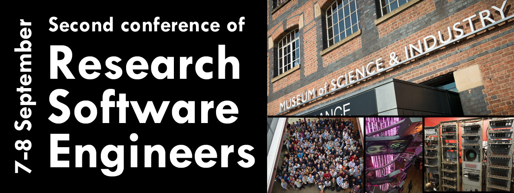

## Save the date - 7-8 September 2017

Following the [success](https://www.software.ac.uk/blog/2016-10-04-future-rses-looking-rosy-following-phenomenal-conference) of the [First Conference of Research Software Engineers](http://www.rse.ac.uk/conf2016), we are pleased to announce that the Second Conference will be held at the Museum of Science and Industry at Manchester on the 7-8 September 2017. As for the First Conference, we are expecting an international mix of over 200 attendees, and a programme full of interesting talks, discussion sessions and practical workshops.

## Join the committee

Would you like to help organise and run the Second Conference? The [organisers of the First Conference](http://www.rse.ac.uk/conf2016_contact) enjoyed the experience, and were an integral part of making the First Conference a success. We are now looking for people who like to help run the Second Conference. If you are interested in volunteering, then please [fill in this form](https://goo.gl/forms/MNMHJ3WAUVVyDfmq1). If you want to know what is involved, then please [get in touch](mailto:Christopher.Woods@bristol.ac.uk), or contact one of the [First Conference organising committee](http://www.rse.ac.uk/conf2016_contact). There is also the #conf2017 channel on the UKRSE Slack group on which you can ask questions (instructions to join this can be [found here](http://www.rse.ac.uk/slack)).

**Please [complete the form](https://goo.gl/forms/MNMHJ3WAUVVyDfmq1) before the 8th January**. You will be advised if you are successful in the week of the 9th January, with the first meeting of the Second Organising committee taking place on Skype during the week of the 16th January. Following this, the Second Conference organising committee will meet on Skype for short meetings, initially fortnightly, but then moving to weekly as the conference approaches (the First Organising committee met from 2pm-3pm on Tuesdays. A similar time suitable for members of the Second Organising committeee will be found). It helps if members of the organising committee can attend the conference, and travel up at least the day before. For their trouble, members of the Second Organising committee will be given free registration to the conference.

## Calls for Talks, Discussion Workshops and Practical Workshops

We anticipate releasing the calls for Talks, Discussion Workshops and Practical workshop in early April 2017. The format will likely be very similar to the calls for the [First Conference](http://www.rse.ac.uk/conf2016_calls). Please check back here in April for more details.

## Registration

We anticipate opening registration for attendees in June 2017. The conference was [heavily oversubscribed](https://www.software.ac.uk/blog/2016-10-04-future-rses-looking-rosy-following-phenomenal-conference) last year, so we encourage you to register early to avoid disappointment. We will announce the date of opening registration nearer the time, via this website, the UKRSE mailing list, the UKRSE Slack group and Twitter (using hashtag #RSE17).

## Sponsorship

We are very grateful for the [companies that sponsored](http://www.rse.ac.uk/conf2016_sponsors) the First Conference, and who helped make it such a success. With over 200 attendees from 14 countries, sponsorship provided both significant exposure, and more importantly, a good opportunity for companies and organisations to connect with Research Software Engineers from around the World. 

From [feedback](https://www.software.ac.uk/blog/2016-10-19-rse-conference-feedback-what-did-people-think), 95% of attendees of the First Conference said they would attend again, with 100% saying they would recommend the conference to others. The Second Conference will therefore be bigger and better. If you are interested in partnering with us to provide sponsorship, please [get in touch](mailto:Christopher.Woods@bristol.ac.uk). We will be offering different levels of sponsorship, and are happy to talk with you about how we can work together to make the Second Conference a success.

 
 
 
